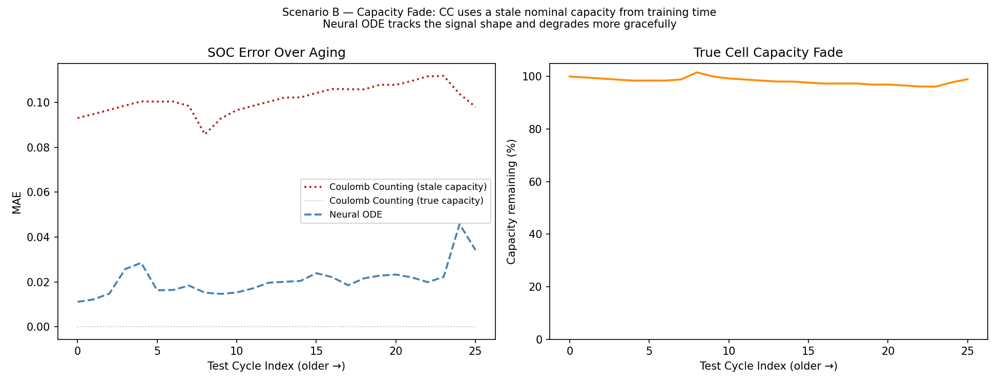
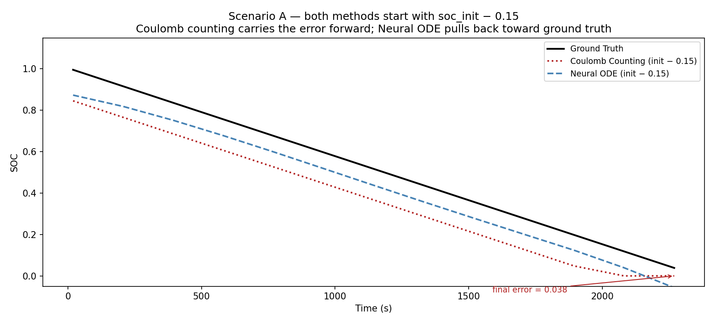
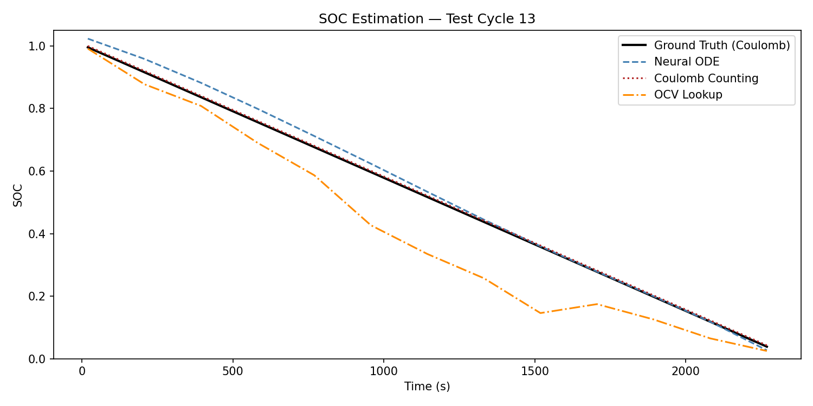
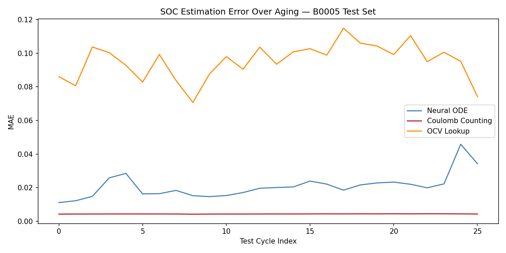

# neural-ode-soc

Neural ODE-based State of Charge (SOC) estimation for Li-ion batteries using the NASA Battery Dataset (B0005).

---



*As the cell ages and true capacity fades, Coulomb counting — anchored to a nominal capacity set at manufacture — drifts further from ground truth every cycle. The Neural ODE has no such parameter. It reads voltage, current, and temperature directly, so there is nothing to go stale.*

---

## What This Is

State of Charge is the battery equivalent of a fuel gauge — what fraction of usable energy remains. Getting it right is harder than it sounds: the "tank size" shrinks as the cell ages, which causes traditional Coulomb counting to accumulate error across a season of use.

This project trains a Neural ODE to learn the continuous-time latent dynamics of a discharging cell from measurable signals (voltage, current, temperature), without hand-coding a physics model. The key result is that the model degrades more gracefully than Coulomb counting as the cell ages, because it never relied on a nominal capacity parameter to begin with.

**Design framing:** the Neural ODE is an offline analysis tool, not a real-time BMS replacement. The adaptive ODE solver is too slow for embedded use. The intended role is as a correction signal for an online estimator — run it after each discharge cycle to recalibrate the capacity parameter that Coulomb counting is using, or as the process model inside an Extended Kalman Filter.

---

## Robustness to Bad Initialization



Coulomb counting requires a known `soc_init`. When that value is wrong — a common failure mode after a cell sits at unknown charge state, or after a sensor recalibration — the error is permanent. CC integrates forward from the bad start with no correction mechanism.

The Neural ODE infers its initial latent state from the first observed signal rather than a user-supplied scalar, so it is not exposed to this failure mode in the same way. Given the same perturbed initial condition, it pulls back toward the true trajectory as the discharge progresses.

---

## SOC Estimation Across the Test Set



Per-cycle SOC prediction on a mid-life test cycle. Ground truth in black, Neural ODE in blue, Coulomb counting and OCV lookup as baselines.



MAE across all test cycles. The test set is chronologically late in the cell's life — the model trained only on healthy early cycles and must generalize to a degraded cell.

---

## Architecture

```
x = [V, I, T]  (3 measurable signals)

encoder:   Linear(3 → 2)         maps first observation to initial latent state z₀
ODEFunc:   MLP(2+3 → 50 → 2)    learned dynamics  dz/dt = f(z, u(t))
decoder:   Linear(2 → 1)         maps latent state z(t) → SOC(t)
```

Input features are interpolated across the time grid so the ODE function can query `u(t)` at any solver step. Time is normalized to `[0, 1]` per cycle. Solver: dopri5, rtol=1e-3, atol=1e-3.

---

## Data

**NASA Li-ion Battery Aging Dataset — B0005**
- 18650-format Li-ion cell cycled to end-of-life (~30% capacity fade)
- Constant current discharge at 2A, room temperature
- 168 discharge cycles extracted from raw `.mat` files
- Split: 70% train / 15% val / 15% test, chronologically by cycle index

The chronological split is intentional — early (healthy) cycles are training data, late (degraded) cycles are the test set. This simulates real deployment where a model trained on a fresh cell must generalize to an aged one.

> Raw `.mat` files not included. Download from [NASA PCoE](https://data.nasa.gov/dataset/li-ion-battery-aging-datasets) and place in `data/raw/`.

---

## Baselines

| Method | Description |
|---|---|
| **Coulomb Counting** | Physics-based current integration. Requires known capacity and initial SOC. Degrades as capacity fades. |
| **OCV Lookup** | Voltage-to-SOC interpolation table fit on training cycles. No current or temperature used. |
| **Neural ODE** | Learns latent continuous-time dynamics from all three signals. No explicit capacity parameter. |

---

## Structure

```
neural-ode-soc/
├── data/
│   └── .gitkeep
├── figures/
│   └── .gitkeep
├── 01_eda.ipynb             # discharge curve visualization, capacity fade, data quality
├── mat_to_csv.py            # convert raw .mat files to per-cycle CSVs
├── preprocess.py            # load cycles, remove relaxation rows, split, normalize
├── NeuralODE.py             # ODEFunc (MLP dynamics) with set_interpolator pattern
├── baselines.py             # Coulomb counting and OCV-SOC lookup table
├── train.py                 # training loop — saves checkpoint.pt and ocv_lookup.pkl
├── evaluate.py              # inference, MAE/RMSE metrics, comparison figures
├── evaluate_scenario.py     # robustness scenarios: bad init and capacity fade
└── requirements.txt
```

---

## Setup

```bash
python -m venv venv
source venv/bin/activate       # Windows: venv\Scripts\activate
pip install -r requirements.txt

python mat_to_csv.py --data_dir ./data/raw --out_dir ./data/processed
python train.py
python evaluate.py
python evaluate_scenario.py
```

---

## Background

This project grew out of research applying Neural ODEs to ocean sensor data reconstruction — both problems involve learning latent continuous-time dynamics from sparse, noisy observations of a physical system.

For battery SOC the Neural ODE learns:

```
dz/dt = f(z, u(t))    where z is a 2D latent state, u = [V, I, T]
SOC(t) = g(z(t))
```

rather than relying on the integral form of Coulomb counting, which accumulates error over time and degrades as the nominal capacity parameter goes stale. The latent formulation is a natural fit for future extensions: encoding degradation state as additional latent dimensions, or plugging the learned dynamics directly into an Extended Kalman Filter as the process model.